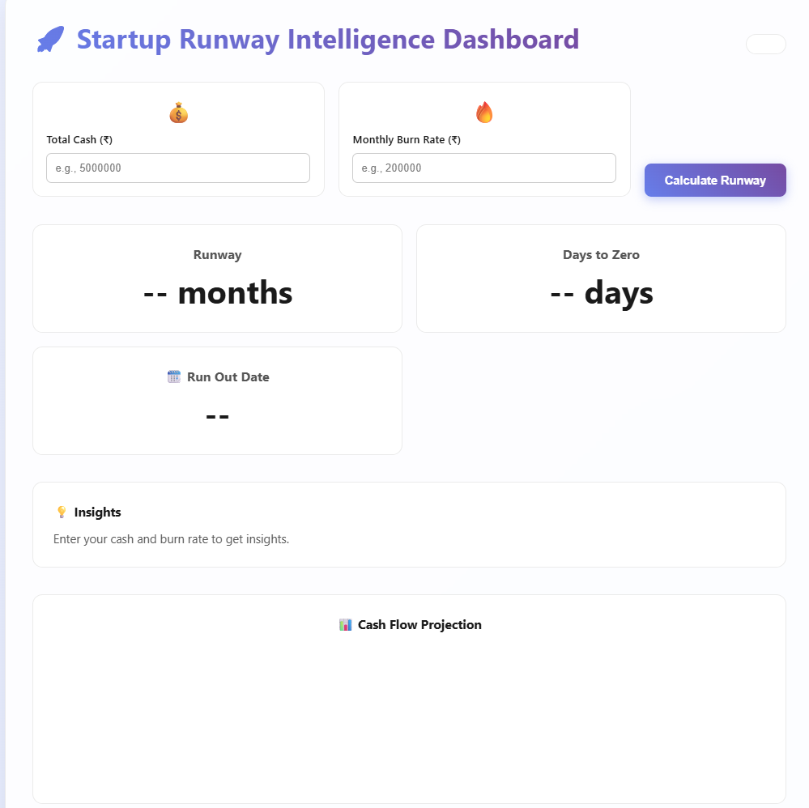
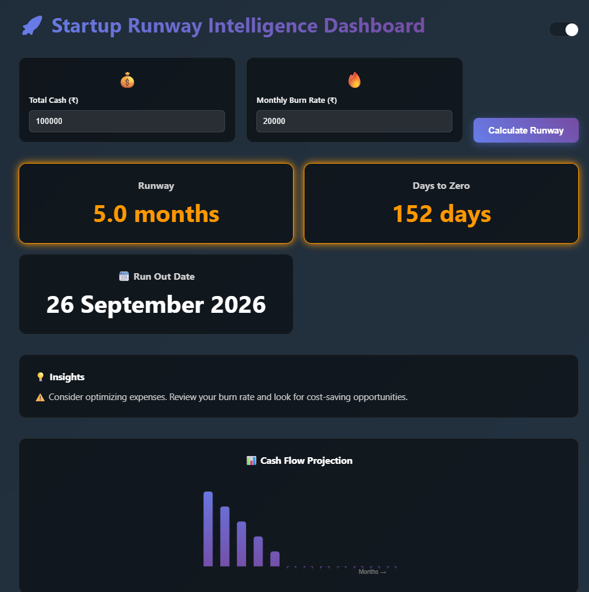

# Lakshya--ecell-recruitment-project
** LIVE DEMO
https://lakshya-jaiswal07.github.io/Lakshya--ecell-recruitment-project/
## 📸 Screenshots

### 🌞 Light Mode

### 🌙 Dark Mode

# 🚀 E-Cell Runway Calculator

## 📌 Problem

Many founders struggle to track how long their money will last (runway).

## 💡 Solution

This project is a simple frontend tool that calculates how many months of runway remain based on:

* Total cash
* Monthly burn rate

## ⚙️ Features

* Real-time runway calculation
* Visual feedback (Safe / Danger zone)
* Responsive UI (mobile-friendly)
* Clean and minimal design

## 🎨 Design Decisions

* Used simple UI for clarity and speed
* Focused on readability and user experience
* Color-coded output for quick understanding

## 🚀 Tech Stack

* HTML
* CSS
* JavaScript

## 📱 How to Run

1. Open `index.html`
2. Enter values
3. View runway instantly

## 🌟 Future Improvements

* Graph visualization
* Dark mode
* Better financial insights
